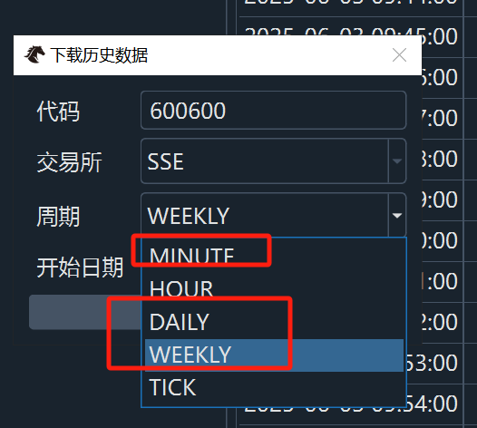
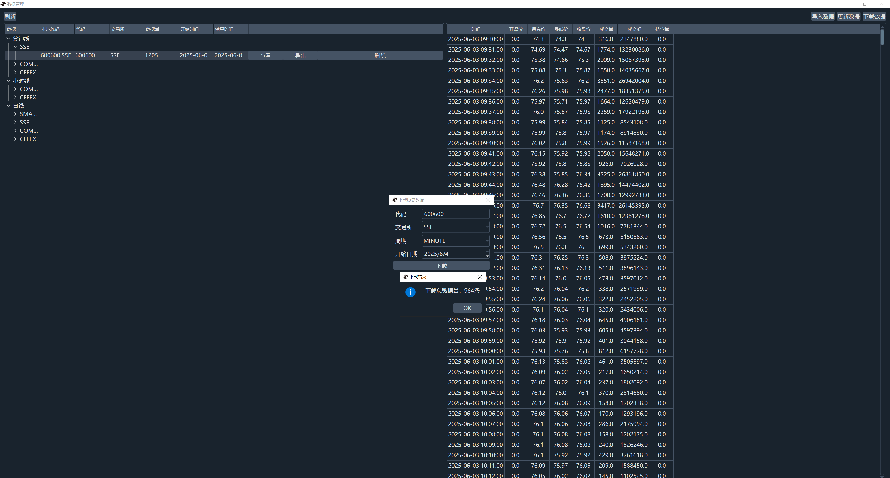
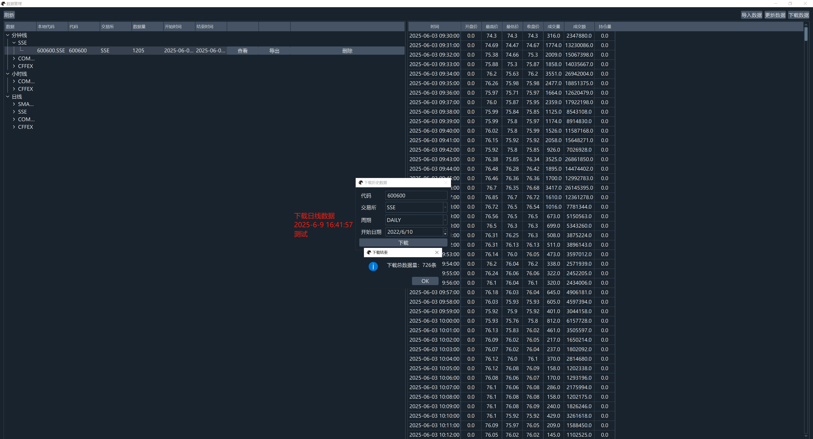

# VeighNa框架的AKShare数据服务接口

<p align="center">
  
</p>

<p align="center">
    
    
    
    
</p>

## VNPY测试截图

测试时间 2025-6-9 16:45:39

akshare 目前能适配vnpy下载的， 只支持 分钟、日、周。注意1分钟数据只返回近5个交易日数据且不复权。

<p align="center">
  
</p>

分钟下载：

<p align="center">
  
</p>

日线下载：

<p align="center">
  
</p>


## 说明

我试了几个发布的vnpy_akshare，有点问题，不支持分钟，我自己也想快速安装，就提交了一版。

基于akshare开发，支持以下中国金融市场的K线数据：

* 期货：
  * CFFEX：中国金融期货交易所
  * SHFE：上海期货交易所
  * DCE：大连商品交易所
  * CZCE：郑州商品交易所
  * INE：上海国际能源交易中心
* 股票：
  * SSE：上海证券交易所
  * SZSE：深圳证券交易所
  * BSE: 北京证券交易所
* 基金：需要使用修改版[**akshare**](https://github.com/lstwzd/akshare)
  * SSE：上海证券交易所
  * SZSE：深圳证券交易所
  
## 数据使用事项

1. 主要支持A股数据，不支持期货数据
2. 支持基金数据，但需要采用安装修改版[**akshare**](https://github.com/lstwzd/akshare)
3. 支持日线级别数据，tick级别不支持
4. akshare数据源采用证券网站抓取，影响可能存在较慢的问题。

## 安装

安装环境推荐基于3.0.0版本以上的【[**VeighNa Studio**](https://www.vnpy.com)】。

直接使用pip命令：

```
pip install vnpy_akshare_adapter
```


或者下载源代码后，解压后在cmd中运行：

```
pip install .
```


## 使用

在VeighNa中使用AkShare时，需要在全局配置中填写以下字段信息：

|名称|含义|必填|举例|
|---------|----|---|---|
|datafeed.name|名称|是|akshare|
|datafeed.username|用户名|否|token|
|datafeed.password|密码|否|token|
